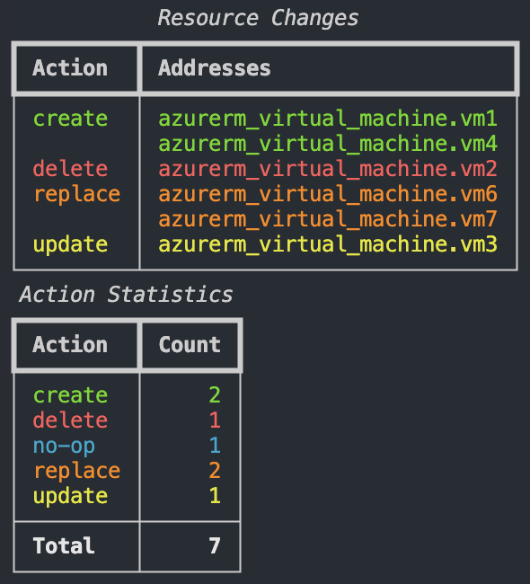
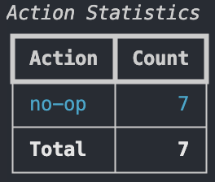

# tfplan-summary (Terraform Plan Summary)

`tfplan-summary` is a Python command-line utility that parses and prints a summary of the Terraform plan output.

## Examples
`python main.py -p examples/tfplan.json -c`



`python main.py -p examples/no-op.json -c -r`


`python main.py -p examples/no-op.json -c -s`



## Installation
```bash
# Clone repository
git clone https://github.com/vetlekise/tfplan-summary.git && cd tfplan-summary

# Install dependencies
pip install -r requirements.txt
```

## Testing
This project uses `pytest` for testing.
```bash
# Install pytest
pip install -r tests/requirements.txt 

# Run pytest
pytest tests/test_main.py
```

## Usage
### Generate Terraform Plan
```bash
# First, generate the binary plan file
terraform plan -out=tfplan

# Then, convert the binary plan to JSON format
terraform show -json tfplan > tfplan.json
```

### Run Program
```bash
# Basic usage (shows both statistics and resource tables)
python main.py -p tfplan.json

# Show summary with colors
python main.py -p tfplan.json -c

# Show only the statistics table
python main.py -p tfplan.json -s

# Show only the resource changes table, with color
python main.py -p tfplan.json -r -c
```

> Note: You can find a couple of JSON example files in the `./examples/json` folder.

### Command-line Options
```bash
# Run program with help flag
main.py -h

# Output
options:
  -h, --help        show this help message and exit
  -p, --path PATH   Path to the Terraform plan JSON file (default: None)
  -c, --color       Display output with colors (default: False)
  -s, --statistics  Display only the statistics table (if neither -s nor -r is specified, both are shown) (default: False)
  -r, --resources   Display only the resource changes table (if neither -s nor -r is specified, both are shown) (default: False)
```