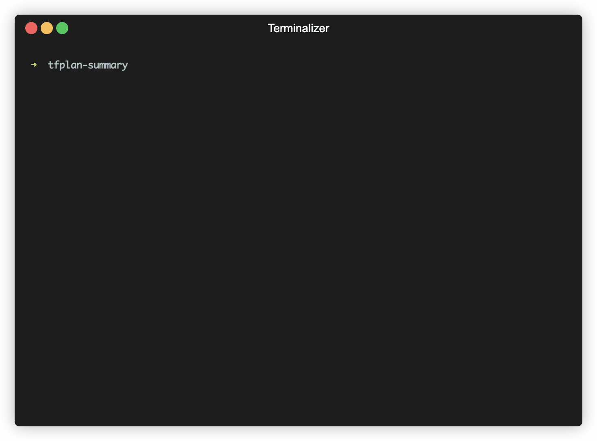

# tfplan-summary (Terraform Plan Summarizer)

A Python command-line utility that parses and prints a summary of the Terraform plan output.



## Installation
Clone the repository:
```bash
git clone https://github.com/vetlekise/tfplan-summary.git
cd tfplan-summary
```

Create and activate a Python virtual environment:
```bash
python3 -m venv .venv
source .venv/bin/activate
# windows: .venv\Scripts\activate
```

Install the package with pip:
```bash
pip3 install .
```

## Quick Usage
Use an example Terraform plan output in the `/examples/json` directory to test the package:
```bash
tfplan -p examples/json/tfplan.json
```

For more usage examples, see the [usage](docs/usage/index.md) page.
