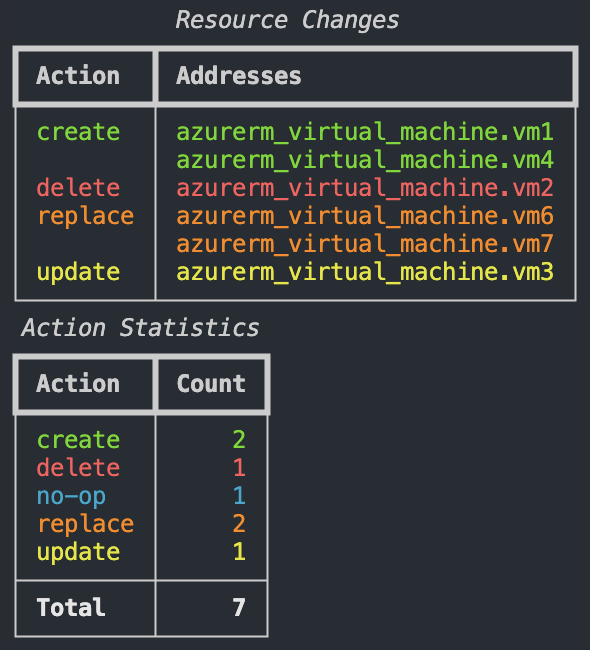
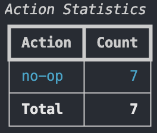

# Usage
## Generate Terraform Plan
First, generate the binary plan file.
```bash
terraform plan -out=tfplan
```

Then, convert the binary plan to JSON format.
```bash
terraform show -json tfplan > tfplan.json
```

## Run Program
```bash
# Basic usage (shows both statistics and resource tables)
tfplan -p tfplan.json

# Show summary with colors
tfplan -p tfplan.json -c

# Show only the statistics table
tfplan -p tfplan.json -s

# Show only the resource changes table, with color
tfplan -p tfplan.json -r -c
```

> [!NOTE]
> You can find a couple of JSON example files in the `./examples/json` folder.

### Outputs

Click the triangles to view the output images.

<details markdown="1">
  <summary>View output for <code>tfplan -p examples/json/tfplan.json -c</code></summary>

  
</details>

<details markdown="1">
  <summary>View output for <code>tfplan -p examples/json/no-op.json -c -r</code></summary>

  
</details>

<details markdown="1">
  <summary>View output for <code>tfplan -p examples/json/no-op.json -c -s</code></summary>

  
</details>

## Command-line Options
See command-line options.
```bash
tfplan -h
```

Current output.
```bash
usage: tfplan [-h] -p PATH [-c] [-s] [-r]

Terraform Plan Summarizer

options:
  -h, --help        show this help message and exit
  -p, --path PATH   Path to the Terraform plan JSON file (default: None)
  -c, --color       Display output with colors (default: False)
  -s, --statistics  Display only the statistics table (if neither -s nor -r is specified, both are shown) (default: False)
  -r, --resources   Display only the resource changes table (if neither -s nor -r is specified, both are shown) (default: False)
```
